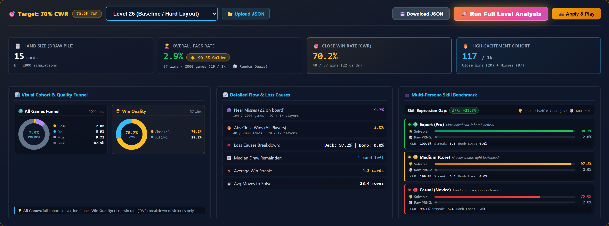
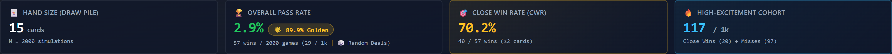
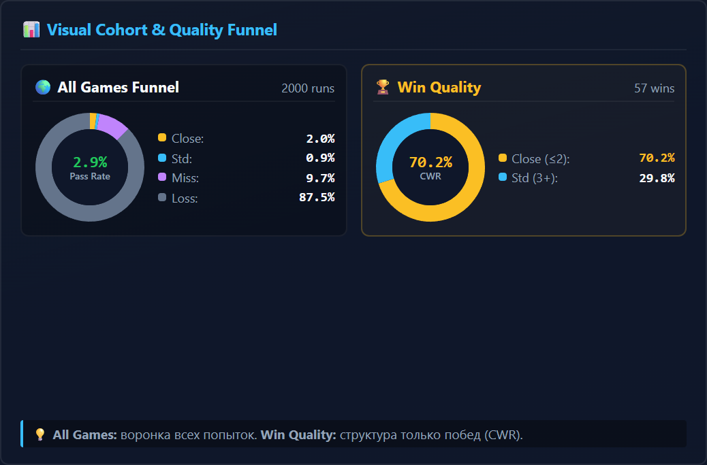
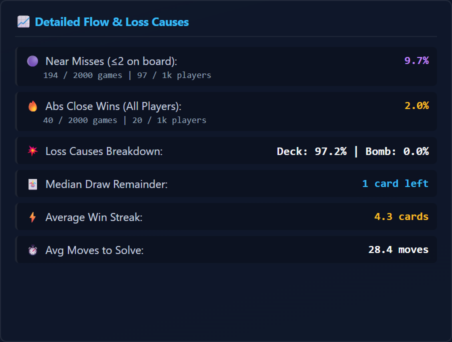
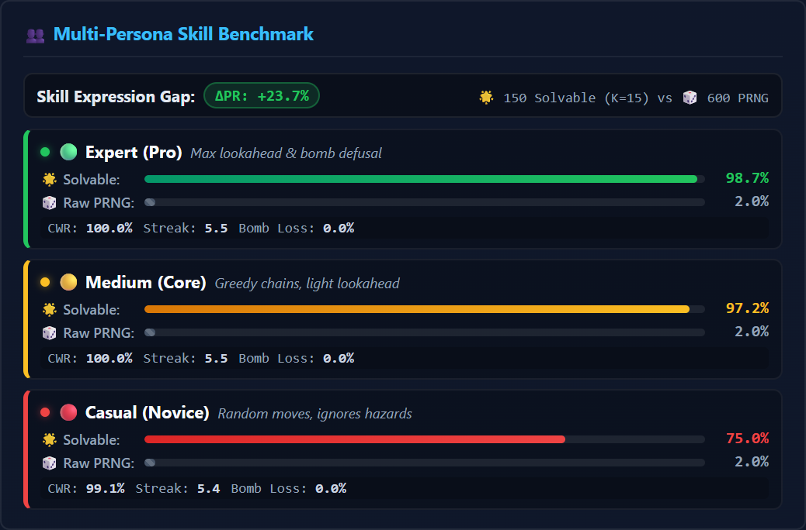
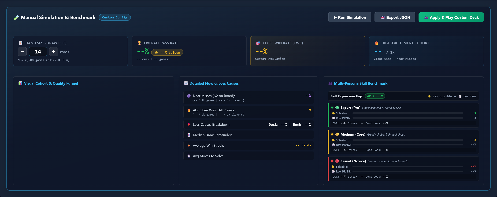
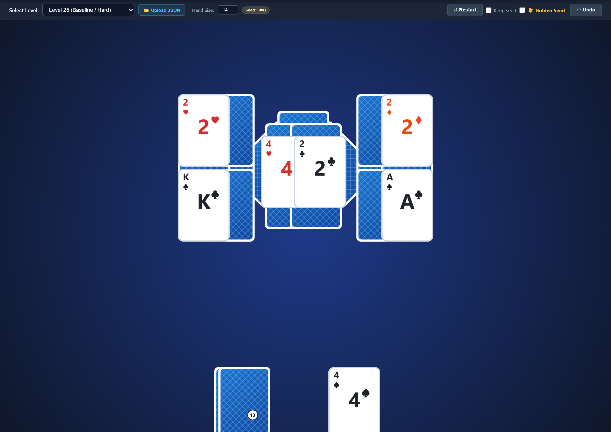

# Softgames — Operation Close Win: User Guide & Workbench Manual

**Live Application:** [https://thegod322.github.io/softgames-closewin/](https://thegod322.github.io/softgames-closewin/)  
**Interactive Chrono-Timeline:** [https://thegod322.github.io/guapiko-timeline-viewer/](https://thegod322.github.io/guapiko-timeline-viewer/)  
**Source Code Repository:** [https://github.com/Thegod322/softgames-closewin](https://github.com/Thegod322/softgames-closewin)

---

## ⚡ Quick Start: Switching to the Difficulty Tuner

The web application opens by default in the **🎮 Playable Prototype** view.

To switch to the balancing and simulation workbench, click the **📊 Difficulty Tuner & Monte Carlo** tab in the top navigation bar:

---

## 1. Module 2: Difficulty Tuner & Monte Carlo Suite (Primary Tool)

The Difficulty Tuner runs large-scale Monte Carlo simulations ($N=2,000$ runs per level in background Web Workers) to auto-calibrate deck sizes for a **70% Close Win Rate (CWR)**, benchmark player personas, and isolate winnable **Golden Seeds**.

### 1.1 Top Controls Bar

- **Level Select Dropdown:** Switch between presets (`level_25`, `level_31`, `level_43`, `level_54`) or uploaded custom levels.
- **📂 Upload JSON:** Load custom level JSON files directly from your disk (saved to browser `localStorage`).
- **🚀 Run Analysis:** Runs the full $N=2,000$ simulation batch to recalculate all stats.
- **🎮 Apply & Play:** Applies the calibrated deck size and switches directly to the playable game.
- **💾 Download JSON:** Exports the calibrated level file with the new deck size and mined golden seeds.

---

### 1.2 Hero KPI Ribbon (Executive Metrics)

| Metric | Meaning & Target |
| :--- | :--- |
| **🃏 Hand Size (Draw Pile)** | Calibrated number of cards in the stock to achieve the target CWR. |
| **🏆 Overall Pass Rate** | Left: baseline random PRNG win rate (e.g. `2.6%`). Right: **🌟 Golden Seeds Pass Rate** (e.g. `100%`). |
| **🎯 Close Win Rate (CWR)** | Percentage of wins where the player finished with $\le 2$ cards left in the draw pile (Target: **70% ± 2%**). |
| **🔥 High-Excitement Cohort** | Players per 1,000 experiencing high drama: **Close Wins** + **Near Misses** ($\le 2$ cards left on board upon loss). |

---

### 1.3 Deep Dive Panels

#### A. Visual Cohort & Quality Funnel (Dual Donut Charts)

- **🌍 All Games Funnel (Left Donut — 100% of All Attempts):**  
  Analyzes the entire cohort of $N = 2,000$ simulation runs across 4 distinct player outcomes:
  - 🟡 **Close Wins (e.g. 2.0%):** Player cleared the board with $\le 2$ cards left in the draw pile.
  - 🔵 **Standard Wins (e.g. 0.9%):** Player cleared the board with $\ge 3$ cards left in the draw pile.
  - 🟣 **Near Misses (e.g. 9.7%):** Failed, but left only $\le 2$ cards on the board (commercial high-intent retry trigger).
  - ⚫ **Losses (e.g. 87.5%):** Ran out of draw cards with $\ge 3$ cards remaining on the board.
- **🏆 Win Quality (Right Donut — Analysis of Wins Only):**  
  Isolates **strictly victorious games** (e.g. 57 wins out of 2,000) to evaluate the **Close Win Rate (CWR)**:
  - 🟡 **Close ($\le 2$ cards remaining in stock, e.g. 70.2%):** Meets the brief's target.
  - 🔵 **Std ($3+$ cards remaining in stock, e.g. 29.8%):** Comfortable wins.

> 💡 **The Golden Seeds Link:**  
> Even when a level's overall pass rate on raw PRNG deals is low (2–4%), any pass rate above 1% proves that winnable shuffles naturally exist even with a tightly tuned deck. Out of a 20,000-deal pool, this provides **~500+ curated Golden Seeds** with an empirical ~100% pass rate, ensuring players always get exciting close wins without suffering from unwinnable card starvation.

---

#### B. Detailed Flow & Loss Causes

| Metric | Meaning |
| :--- | :--- |
| **Near Misses ($\le 2$ on board)** | Percentage of losses where only 1–2 cards remained on the board. This is the prime driver for high-intent retries and extra card purchases. |
| **Abs Close Wins (All Players)** | Absolute close win percentage across the entire player population. |
| **Loss Causes Breakdown** | Shows whether losses occurred due to running out of draw cards (`Deck %`) or failing a hazard (`Bomb %`). |
| **Median Draw Remainder** | Median number of unused cards in the draw pile upon winning (Target: $\le 2$ cards). |
| **Average Win Streak** | Average number of consecutive tableau cards cleared without drawing from the stock. |
| **Avg Moves to Solve** | Average number of card operations required to complete the board. |

---

#### C. Multi-Persona Skill Benchmark (Skill Expression)

Measures win rates across 3 simulated player skill levels ($6 \times 600$ runs):
- 🟢 **Pro / Expert ($\epsilon = 0\%$ error):** Optimal lookahead and modifier prioritization.
- 🟡 **Medium ($\epsilon = 3\%$ error):** Average casual player.
- 🔴 **Casual ($\epsilon = 15\%$ error):** Frequent sub-optimal moves and missed streaks.
- **$\Delta PR$ (Skill Gap):** $PR_{\text{expert}} - PR_{\text{casual}}$. A healthy level shows $\Delta PR \ge 15\%$, confirming player choices drive outcomes.

---

### 1.4 Manual Simulation & Custom Deck Testing Drawer

Click **`▼ Expand Manual Testing`** below the main card to open the custom deck sandbox:

1. **Adjust Hand Size:** Use the **`[ − ]`** and **`[ + ]`** stepper buttons or type a number directly into the deck input.
2. **Click `▶ Run Simulation`:** Runs a full Monte Carlo evaluation on your custom hand size.
3. **Compare Results:** Displays full 1:1 parity metrics (Hero KPIs, Donut charts, Personas, Flow breakdown) for your custom hand size.
4. **Click `🎮 Apply & Play Custom Deck`:** Loads this custom deck size directly into the playable game canvas.
5. **Click `💾 Export JSON`:** Saves the custom level JSON to your disk.

---

## 2. Module 1: Playable Prototype (Game Verification)

To test the tactile game feel and verify card interactions manually, switch to **🎮 Playable Prototype**:

> **Gameplay Summary:** Tap face-up tableau cards with rank $\pm 1$ from the active waste card (with $K \leftrightarrow A$ wrap) to clear the board. Modifiers add tactical objectives: 💣 **Bombs** must be defused before their turn timer hits 0, 🔑 **Keys** unlock 🔒 **Locks**, and ⚡ **Zap cards** clear 2 extra blocking cards. Check **`☑️ Keep seed`** to replay the exact same deal, or toggle **`🌟 Golden Seed`** to test curated winnable close-win layouts.

---

## 3. Production Calibration Summary ($N = 2{,}000$ runs)

| Level ID | Modifiers & Layout | Default Deck | Calibrated Deck (70% CWR) | Random Deal Win Rate | Golden Seed Win Rate |
| :--- | :--- | :---: | :---: | :---: | :---: |
| **level_25** | Standard 3-Peak (21 cards) | 21 | **15 cards** (72.9% CWR) | 2.6% | **100%** |
| **level_31** | ⚡ Zap + 🔒 2 Locks + 🔑 1 Key (26 cards) | 26 | **15 cards** (68.0% CWR) | 4.5% | **100%** |
| **level_43** | Multi-Layer Pyramid (28 cards) | 28 | **16 cards** (70.5% CWR) | 3.1% | **100%** |
| **level_54** | 💣 Bomb Countdown ($T{=}5$, 20 cards) | 20 | **13 cards** (71.1% CWR) | 3.3% | **100%** |

---

## 4. Engineering Deliverables & Technical Specs
- 📄 **1-Page Candidate Brief (Zero-Slop v2):** [`CANDIDATE_BRIEF_V2.md`](./CANDIDATE_BRIEF_V2.md)
- 📊 **Balancing & Mathematical Analysis Report:** [`CANDIDATE_REPORT.md`](./CANDIDATE_REPORT.md)
- ⏱️ **Interactive Development Timeline & Transcripts:** [thegod322.github.io/guapiko-timeline-viewer](https://thegod322.github.io/guapiko-timeline-viewer/)
