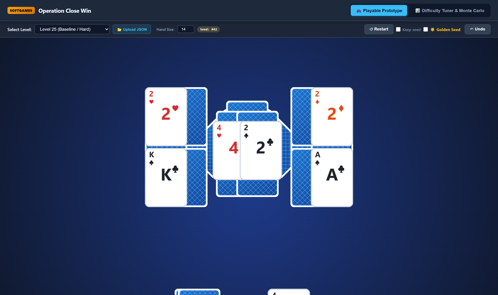
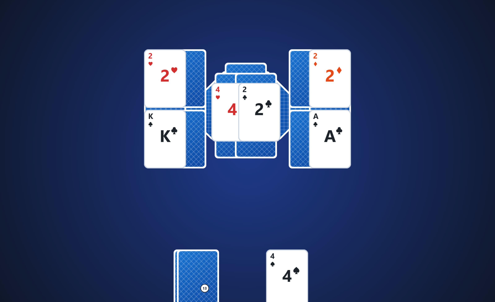
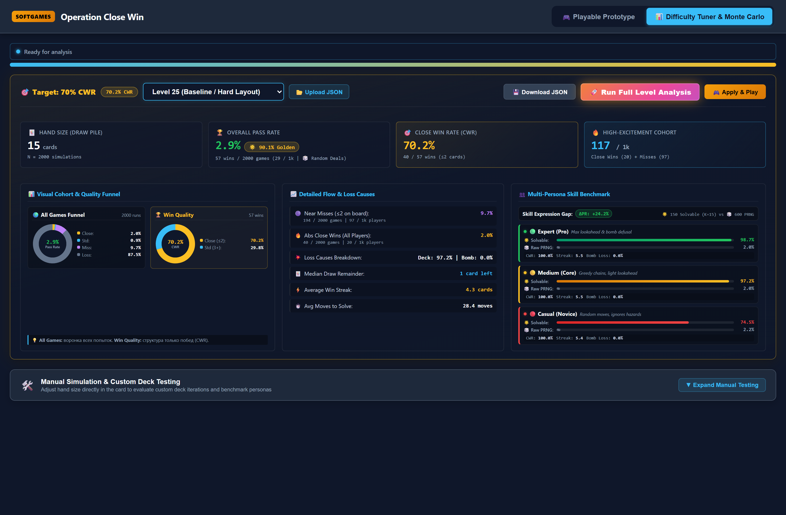
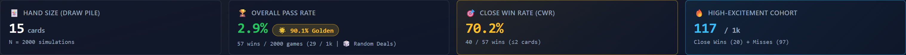
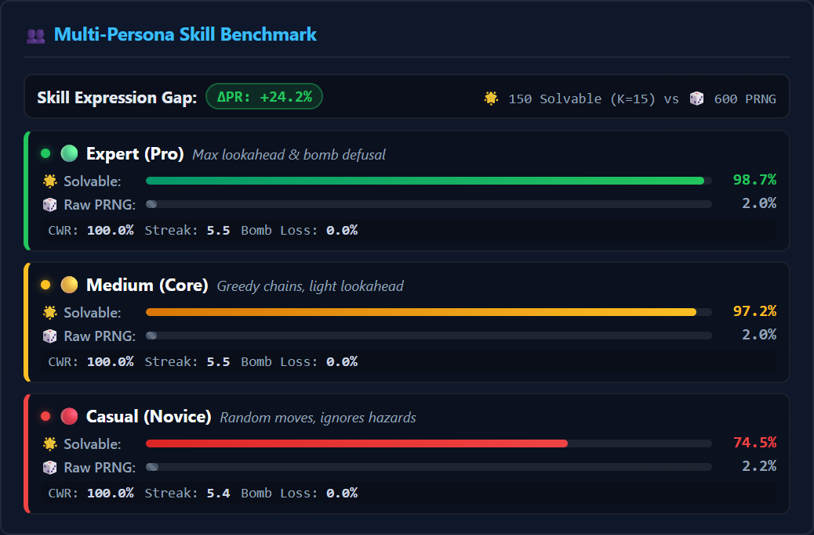

# Softgames — Operation Close Win: Complete Visual User Guide

> **Interactive Solitaire Tripeaks Prototype & Monte Carlo Difficulty Calibration Suite**  
> *A practical guide explaining every screen, control, metric, and simulation workflow in the web application.*

- **Live Application:** [thegod322.github.io/softgames-closewin](https://thegod322.github.io/softgames-closewin/)
- **Chrono-Timeline:** [thegod322.github.io/guapiko-timeline-viewer](https://thegod322.github.io/guapiko-timeline-viewer/)
- **Source Code:** [github.com/Thegod322/softgames-closewin](https://github.com/Thegod322/softgames-closewin)

---

## 📑 Table of Contents
1. [Application Structure & Navigation](#1-application-structure--navigation)
2. [Module 1: Playable Tripeaks Prototype](#2-module-1-playable-tripeaks-prototype)
   - [Toolbar Controls & Hand Size](#21-toolbar-controls--hand-size)
   - [Board Layout & Card Hierarchy](#22-board-layout--card-hierarchy)
   - [Interactive Modifiers (Bombs, Locks, Keys, Zap)](#23-interactive-modifiers-bombs-locks-keys-zap)
   - [Golden Seeds vs. Random Deals](#24-golden-seeds-vs-random-deals)
3. [Module 2: Difficulty Tuner & Monte Carlo Suite](#3-module-2-difficulty-tuner--monte-carlo-suite)
   - [Hero KPIs Ribbon](#31-hero-kpis-ribbon)
   - [Dual Donut Visual Funnels](#32-dual-donut-visual-funnels)
   - [Multi-Persona Skill Expression Benchmark](#33-multi-persona-skill-expression-benchmark)
   - [Manual Simulation & Verification Workbench](#34-manual-simulation--verification-workbench)
4. [Custom Level Upload & JSON Export](#4-custom-level-upload--json-export)

---

## 1. Application Structure & Navigation

The application is divided into two synchronized modules accessible via the top navigation bar:

- **🎮 Playable Prototype:** Interactive WebGL canvas (PixiJS v8) to play levels manually, test tactile game feel, verify modifier interactions, and validate close-win deals.
- **📊 Difficulty Tuner & Monte Carlo:** Headless high-throughput simulation workbench running $N=2,000$ Monte Carlo runs in background Web Workers to auto-tune deck economy and benchmark player personas.

---

## 2. Module 1: Playable Tripeaks Prototype

### 2.1 Toolbar Controls & Hand Size

| Control | Description |
| :--- | :--- |
| **Select Level Dropdown** | Switch between pre-configured preset levels (`level_25`, `level_31`, `level_43`, `level_54`) or any uploaded custom levels. |
| **📂 Upload JSON Button** | Load custom Softgames level JSON files directly from your computer. |
| **Hand Size (Deck Cards)** | Dynamically change the number of cards in the draw pile before playing. Defaults to the calibrated deck size. |
| **Seed Badge (`#Seed`)** | Displays the current deal seed number for deterministic reproducibility. |
| **↺ Restart Button** | Resets and redeals the current level. |
| **☑️ Keep Seed Checkbox** | When checked, restarting redeals the exact same card layout and draw pile order (ideal for testing alternative move sequences). |
| **🌟 Golden Seed Checkbox** | Toggles between **Random Deals** (PRNG shuffle) and **Curated Golden Seeds** (guaranteed winnable close-win deals with 0–2 cards remaining). |
| **↶ Undo Button** | Step backwards by one move to explore branching card plays. |

---

### 2.2 Board Layout & Card Hierarchy

1. **Tableau Cards (Pyramid / Peaks):**
   - **Face-Up Cards:** Available for immediate play if their rank is $\pm 1$ from the active waste card (with $K \leftrightarrow A$ wrap-around).
   - **Face-Down Cards:** Become uncovered and flip face-up once all overlapping parent cards above them are removed.
2. **Draw Pile (Stock):**
   - Located at the bottom left. Displays the remaining number of draw cards.
   - Clicking draws the next card and places it onto the active waste pile.
3. **Active Waste Pile (Discards):**
   - Located at the bottom center. Shows the current card on top of the discard pile.
4. **Streak Counter & Multiplier:**
   - Cleared cards consecutive without drawing from the stock build combo streaks.

---

### 2.3 Interactive Modifiers (Bombs, Locks, Keys, Zap)

- 💣 **Tick-Tock Bomb (`modifier: "bomb"`, $T=5$):**  
  Displays an active turn countdown. Decrements each time you draw from the stock or clear a non-bomb card. Must be cleared before the timer reaches `0`, otherwise detonation triggers a level loss.
- 🔒 **Lock Card (`modifier: "lock_1"`, `lock_2`):**  
  Covered by a transparent padlock overlay. Cannot be tapped or collected until its matching Key card is cleared.
- 🔑 **Key Card (`modifier: "key_1"`, `key_2`):**  
  Clearing this card immediately dispels the matching lock overlay, unlocking the corresponding locked card on the board.
- ⚡ **Zap Card (`modifier: "zap"`):**  
  When collected, emits an electric shockwave that eliminates 2 additional blocking cards from the tableau.

---

### 2.4 Golden Seeds vs. Random Deals

- **Random Deal (PRNG):** A standard randomized shuffle. With a tightly calibrated deck (13–16 cards), the natural win rate is ~3% due to high card starvation (survivorship bias).
- **Golden Seed:** Background Web Workers test ~8,000 deals/second to find seeds where optimal card distribution guarantees a 100% winnable path finishing with $\le 2$ cards in the draw pile.

---

## 3. Module 2: Difficulty Tuner & Monte Carlo Suite

Click the **📊 Difficulty Tuner & Monte Carlo** tab in the top header to enter the calibration workbench:

---

### 3.1 Hero KPIs Ribbon

The top ribbon gives an immediate 4-metric executive health check of the level:

1. **🃏 Hand Size (Draw Pile):**  
   The calibrated deck size determined by bisection search to meet the target $70\% \pm 2\%$ CWR.
2. **🏆 Overall Pass Rate (Random vs. Golden):**  
   Shows the baseline random PRNG pass rate (e.g. `2.6%`) side-by-side with the **🌟 Golden Seeds Pass Rate** (e.g. `100%`).
3. **🎯 Close Win Rate (CWR):**  
   The percentage of all winning games that finish with $\le 2$ cards left in the draw pile (Target: $70\% \pm 2\%$).
4. **🔥 High-Excitement Cohort:**  
   The number of players per 1,000 who experience high drama (Absolute Close Wins + Near Misses where $\le 2$ cards remain on board upon loss).

---

### 3.2 Dual Donut Visual Funnels

- **Left Chart (Random Deals Conversion):**  
  Breaks down the entire cohort of random deals into:
  - 🟢 **Close Wins ($\le 2$ cards left in draw pile)**
  - 🔵 **Standard Wins ($>2$ cards left in draw pile)**
  - 🔴 **Losses (Runs out of cards)**
- **Right Chart (Golden Seeds Conversion):**  
  Visualizes the curated golden seeds cohort, demonstrating 100% completion with a dominant close-win slice.

---

### 3.3 Multi-Persona Skill Expression Benchmark

Simulates 3 distinct player AI archetypes ($6 \times 600$ iterations) to measure how player skill affects pass rates:

- 🟢 **Pro / Expert Persona ($\epsilon = 0\%$ error rate):** Plays greedy lookahead moves with optimal modifier prioritization.
- 🟡 **Medium Persona ($\epsilon = 3\%$ error rate):** Represents an average casual player with occasional sub-optimal plays.
- 🔴 **Casual Persona ($\epsilon = 15\%$ error rate):** Makes frequent sub-optimal moves and misses complex streak combinations.
- **$\Delta PR$ Skill Expression:** The gap between Expert and Casual pass rate ($\Delta PR = PR_{\text{expert}} - PR_{\text{casual}}$). A healthy level yields $\Delta PR \ge 15\%$, proving the outcome depends on player choice rather than pure luck.

---

### 3.4 Manual Simulation & Verification Workbench

| Control | Action |
| :--- | :--- |
| **Deal / Seed Slider** | Scrub through seeds 1 to 150 to inspect individual layouts. |
| **🎮 Play Deal** | Instantly switches to Module 1 and loads this exact seed and hand size into the interactive game canvas. |
| **⚡ Run 1 Sim** | Executes a single step-by-step IS-MCTS simulation and prints the full move log in the terminal below. |
| **🚀 Run 50 Sims** | Runs a batch of 50 Monte Carlo simulations on this specific seed to calculate its individual win rate and average remainder. |
| **💾 Download JSON** | Exports the calibrated level file (with updated `cards_in_stack` and mined golden seeds) as standard JSON. |
| **Live Decision Log** | Real-time terminal output displaying the bot's moves, combo streaks, bomb defusals, and final remainder count. |

---

## 4. Custom Level Upload & JSON Export

You can upload custom Softgames level JSON files at any time:

1. Click **📂 Upload JSON** in either the game toolbar or the tuner header.
2. Select one or multiple `.json` files.
3. The application automatically validates the level schema, parses card coordinates and modifiers, calculates initial deck size, and caches the level in browser `localStorage`.
4. Switch to the new level via the dropdown to play or run auto-calibration.
5. Click **💾 Download JSON** to save the balanced level file back to your disk.
